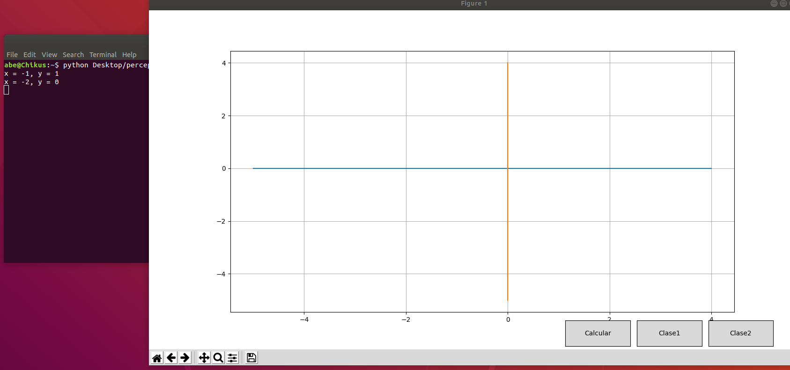
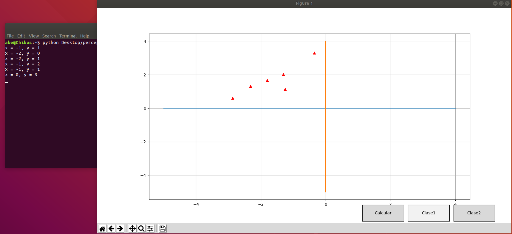
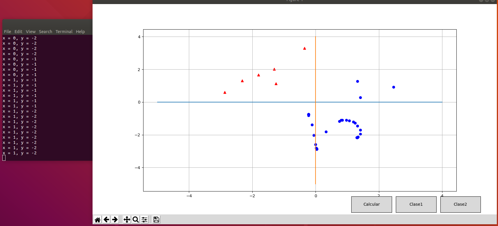
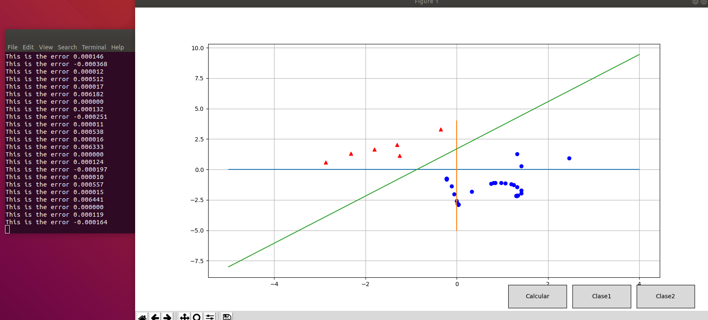

# Perceptron-numpy
Simple perceptron using  numpy and matpotlib
1) Set your mouse pointer in a random coordenate and press the keyboard "SPACE", you will see which coordenate you selected in the terminal. 

2) After you select several points press the button "Clase1" and you will see all points you had selected in RED.

3) Once you have all the points for the frist class1, select more points with the "SPACE" and after that press "Clase2", you will see all points in blue.  

4) Last step is press the button "Calcular" and you will se how the perceptron start to divided the two clases.

#Note
You can modify the activation function, in this case is Sigmoid, but you can create your own version function, also you can modify the number of Epochs.
